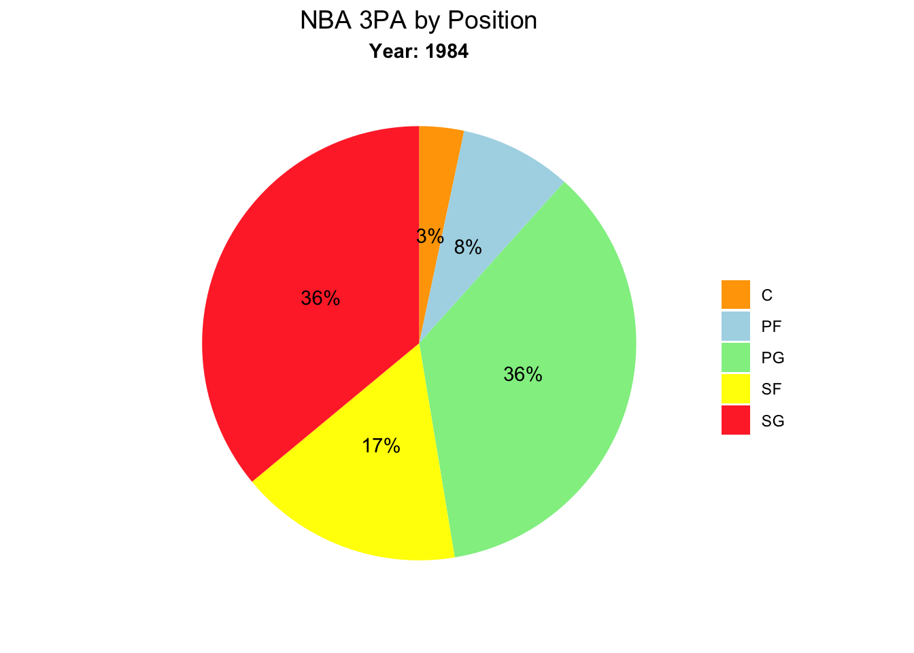

```{r, echo = FALSE, include=FALSE}
library(tidyverse)
library(transformr)
library(ggplot2)
library(plotly)
library(ggthemes)
library(gt)
library(knitr)
library(patchwork)
library(RColorBrewer)
library(gganimate)
library(lubridate)
library(readr)
library(scales)

Seasons_Stats <- read_csv("Seasons_Stats.csv", 
    col_types = cols(GS = col_double(), MP = col_double(), 
        `3P` = col_double(), `3PA` = col_double(), 
        `3P%` = col_double()))


NBA_data <- Seasons_Stats %>% 
  filter(Year >= 1977) %>% 
  select(-'X1')

NBA_data[is.na(NBA_data)] <- 0


Players <- read_csv("Players.csv")

```


```{r, echo = FALSE}
nba_data2 <- NBA_data %>% 
  filter(Tm != "TOT") %>% 
  rename(twoPoint = '2P',
         twoPointP = '2P%',
         threePoint = '3P',
         threePointP = '3P%',
         freethrowP = 'FT%',
         FGP = 'FG%',
         USGP = 'USG%',
         threePointAttemps = '3PA',
         twoPointAttemps = '2PA',
         eFG = 'eFG%') %>% 
  select(Year, Player, Pos, Tm, G, MP, PER, FG, FGA, FGP, threePoint,
         threePointP, threePointAttemps, twoPoint, twoPointAttemps,
         twoPointP, eFG, FT, FTA, freethrowP, ORB, DRB, AST, BLK,
         PF, PTS, Age) %>% 
  group_by(Tm, Year) %>% 
  #Statistics by team by year
  mutate(Tm3PointAttempts = sum(threePointAttemps),
         TmPoints = sum(PTS),
         TmPPG = (TmPoints/82),
         TmPER = mean(PER),
         TmFGP = mean(FGP),
         TmFGA = sum(FGA)) %>% 
  ungroup() %>% 
  #Statistics by year for the entire NBA
  group_by(Year) %>% 
  mutate(YearPoints = sum(PTS),
         YearPPG = (YearPoints/82/43),
         Year3PA = sum(threePointAttemps),
         YearAvgMinutesPlayed = mean(MP),
         YearAvgPER = mean(PER),
         top3PP = max(threePointP),
         AvgAge = mean(Age)) %>% 
  ungroup() %>% 
  #Additional Statistics by Players
  group_by(Year, Player) %>% 
  mutate(PlayerPPG = PTS/G) %>% 
  ungroup() %>% 
  #I will filter the data to the teams still present in the nba
  filter(Tm %in% c("ATL", "BOS", "CLE", "DAL",
                   "DEN", "DET", "GSW", "BRK",
                   "HOU", "IND", "LAC",
                   "LAL", "MEM", "MIA", 
                   "MIL", "MIN", "NOP",
                   "NYK", "ORL", "PHI",
                   "PHO", "POR", "SAC",
                   "SAS", "TOR", "UTA"))

nba_join_data <- nba_data2 %>%
  inner_join(Players,
             by = "Player")

```


## Overview

Not uncommon for most professional sports, the NBA faced a plethora of rule changes and episodic play styles over the years. These dynamics have birthed vast, complex datasets that allow users to analyze gradients between current statistics and those of the past. Inspecting these details allow for a deeper understanding and appreciation of "the game". Four decades since the original NBA merger, casual viewers and devoted fans have watched shifts in shot selection, play style, top performers, scoring, and team composition. Taking a look at the kaggle dataset "NBA Player States Since 1950" can answer questions like how the NBA has changed since the merger (1977), and how it changed within specific time periods. 

## Scaling Long Term Changes

Perhaps the easiest method of acknowledging change is to model the most common statistics over the entirety of the NBA's existence. Graphs are the easiest way to depict, and visualize what story the data is telling, the diagrams below attempt to highlight how the NBA has changed as a whole. 

### Scoring and Field Goal Attempts (FGA)

```{r, echo = FALSE}
 nba_join_data %>% 
  filter(Tm %in% c("BOS", "MIL", "LAL", "NYK", "HOU"),
         Year != 1999,
         Year != 2012) %>% 
  ggplot(aes(x = Year, y = TmPPG, color = Tm)) +
  geom_line() + 
  theme_minimal() +
  theme(legend.position = "right") + 
  scale_color_manual(values = c("BOS" = "#009900",
                     "MIL" = "#006600",
                     "LAL" = "#9933FF",
                     "NYK" = "#FF6600",
                     "HOU" = "#FF0000")) + 
  labs(title = "NBA Team Points Per Game (1977 - 2017)",
       x = "",
       y = "",
       color = "Team") -> teamPPG_graph

#teamPPG_graph
 
nba_join_data %>% 
   filter(Year == "1986") %>% 
   ggplot(aes(y = TmPoints, x = TmFGA)) + 
   geom_point(aes(color = Tm, 
                  size = TmFGP),
              alpha = .6) + 
   theme(legend.position = "none",
         panel.grid.major.y = element_line(color = "black"),
         panel.grid.major.x = element_blank(),
         panel.background = element_rect(
                                         fill = "white")
                                                          ) + 
   labs(title = "Total Points (y) and FGA (x) of Teams in 1986",
        x = "",
        y = "",
        caption = element_text("*size determined by the team's average player efficiency"),
        color = "Team") -> TeamPPG_graph1986
 
 #TeamPPG_graph1986
 
 nba_join_data %>% 
   filter(Year == "2017") %>% 
   ggplot(aes(y = TmPoints, x = TmFGA)) + 
   geom_point(aes(color = Tm, 
                  size = TmFGP),
              alpha = .6) + 
   theme(legend.position = "none",
         panel.grid.major.y = element_line(color = "black"),
         panel.grid.major.x = element_blank(),
         panel.background = element_rect(
                                         fill = "white")
                                                          ) + 
   labs(title = "Total Points (y) and FGA (x) of Teams in 2017",
        x = "",
        y = "",
        color = "Team") -> TeamPPG_graph2017
  
 #TeamPPG_graph2017
 
(TeamPPG_graph1986 / TeamPPG_graph2017) / teamPPG_graph   -> three_graphs_team_ppg

three_graphs_team_ppg
```

With respect to each of the point graphs above, it appears that in both years, the vast majority of teams scored between 8400 and 9600 points. While the combined points scored in 1986 may be slightly greater then that of 2017, teams in 2017 were producing comparable numbers with a whopping 200-300 fewer shot attempts. The bottom line graph provides insight that the previous two didn't, the average points scored in any individual game dropped signifigantly between 1990 and 2010.

### Points By Position 

```{r, echo = FALSE}
knitr::include_graphics("Points_by_Position_line.gif")
```

Near the NBA's beginning, Centers (C) carried more than their weight in the scoring department, while Power Forwards (PF), and Point Guards (PG) rounded out the bottom. Alternatively, in 2017 PGs and Shooting Guards (SG) were relied on heavily for their scoring ability. 

A second way to visualize this change... 

```{r, echo = FALSE}
knitr::include_graphics("Points_by_Position.gif") 
```


### Composition of the League

```{r, echo = FALSE}

```

The composition of the NBA fluctuates, but never to an obvious lack of one position or another. No specific category ever drops below 17%, or reaches above 24%. 

### 3 Pointers

If you have any familiarity with professional basketball, you are already aware that if you shoot behind a curved line (placed at a specified distance) any made basket is worth three points. 3 Pointers were already introduced before the years that begin this dataset, so teams had the unrestricted opportunity to use this to their advantage. What positions accounted for most of the attempts was an additional variable. 

```{r, echo = FALSE}
nba_data2 %>% 
  filter(Year %in% c(1977:2017)) %>% 
  filter(Tm %in% c("BOS",
                   "MIL",
                   "LAL",
                   "LAC",
                   "ATL",
                   "DEN",
                   "ORL")) %>% 
  ggplot(aes(x = Year)) + 
  geom_line(aes(y = Tm3PointAttempts/9, color = Tm),
            size = 1) +
  scale_x_continuous(n.breaks = 9) +
  scale_y_continuous(name = "",
                     n.breaks = 6) + 
  theme_wsj() + 
    theme(legend.position = "bottom",
          legend.title = element_blank()) + 
  labs(title = "Team 3 Point FGA All Time") + 
  theme(plot.title = element_text(size = 15),
        axis.title.y.left = element_text(size = 9)) -> threePA_graphAllTime

threePA_graphAllTime
```

For most graphs that encompass team statistics, I chose 7 organizations at random for the sake of easy viewing. A strong correlation between Year and three point shot attempts (3PA) appears above. 

```{r, echo = FALSE}

```

As the NBA continued to progress, players of all positions became more skilled. In the 80s and 90s, point guards took the majority of 3PA, often accounting for over a third of this category. PG legends like Magic Johnson, Isiah Thomas, and John Stockton ruled the 80s, while the likes of Michael Jordan, Reggie Miller, and Clyde Drexler (all shooting guards) owned the 90's. Bigs continued to grow in versatility, and eventually began to merge roles with other positions, not only could they dominate with their size but they started shooting jump shots and passing the ball with high precision. The pie chart above depicts a change in who shoots three pointers, with SFs, PFs, and Cs all contributing as the league entered the 2010s. Recalling the graph that showed the decay of how many points were scored in an average game, we can infer that the three pointer through a curveball at the NBA. Originally starting out as asset only for skillful guards, it didn't seem to be a positive contribution to overall scoring until the responsibility of shooting three pointers was more evenly distributed between positions. A second possibility is that teams may not have utilized this new rule hardly at all until it became efficient. The average player efficiency rating (PER), which describes how efficient players were at playing basketball, has had no significant trends, suggesting that the second of the two though processes may be correct. 

```{r, echo = FALSE}
nba_data2 %>% 
  filter(Tm %in% c("BOS",
                     "ATL",
                     "BRK",
                     "CLE",
                     "DAL",
                     "DEN",
                     "DET",
                     "GSW")) %>% 
  ggplot(aes(x = Year)) +
  geom_line(aes(y = TmPER, color = Tm), size = .5) + 
  scale_color_colorblind() + 
  scale_x_continuous(n.breaks = 10) + 
  theme_economist() + 
  theme(legend.position = "right",
        axis.title.x = element_blank()) + 
  labs(title = "Average Team PER by Year",
       x = "",
       y = "",
       color = "Team") -> teamPER_by_year_graph

teamPER_by_year_graph
```

Perhaps an even more important question is if teams that shot more three pointers scored more points, or if the decreased chance of making the shot negatively affected their scoring. 


```{r, echo = FALSE}
nba_data2 %>% 
  filter(Year %in% c(1984)) %>% 
  ggplot(aes(x = TmPoints)) +
  geom_point(aes(y = Tm3PointAttempts, color = Tm)) + 
  theme_minimal() +
  theme(legend.position = "none") +
  labs(title = "1984",
       x = "",
       y = "") + 
  theme(plot.title = element_text(hjust = 0.5,face = "bold"))  -> hello1

nba_data2 %>% 
  filter(Year %in% c(2017)) %>% 
  ggplot(aes(x = TmPoints)) + 
  geom_point(aes(y = Tm3PointAttempts, color = Tm))+
  theme(legend.position = "none") + 
  labs(title = "Individual Team's 3PA (y)  and Total Points (x)",
       y = "",
       x = "2017") + 
  theme_minimal() +
  theme(plot.title = element_text(face = "bold", hjust = 0.5),
        axis.title.x = element_text(face = "bold"),
        legend.position = "none")  -> hello2

hello1 / hello2 -> correlation_graph 
 
correlation_graph
```


After filtering the data to only the years 1984 and 2017, it is confirmed that current teams are scoring amounts similar to those of teams in the 1980s. There is a very weak, if any, correlation (either positive or negative) in the summary of 1984. Organizations that were in the top 25% for 3PA finished all across the board, some finished the season with very high point totals while others were below average. An immediate difference is seen in the 2017 summary, aside from two outliers, teams that attempted more than 2250 three pointers finished almost exclusively in the top half of total points scored. 

## NBA by Decade


### The 1980's

The 80s was an era of dominant bigs and quick, skillful guards, a period that rejuvenated the NBA from it's previous funk. From rebuilding some of the most competitive rivalries in sports, to formation of the "Dream Team" for the olympics, basketball in this period was nothing short of spectacular. The 1980s featured a game that was freed from petty fouls that slowed down the game, allowing for physical and fast play. These characteristics justify the high scoring, and phenomenal centers fans witnessed. 

```{r, echo = FALSE}
nba_join_data %>% 
  filter(Year %in% c(1980:1989)) %>% 
  group_by(Player) %>% 
  mutate(games_played = sum(G),
         decade_points = sum(PTS),
         decade_FGP = mean(FGP),
         decade_AST = sum(AST)) %>% 
  arrange(desc(decade_points)) %>% 
  distinct(Player, decade_points, decade_FGP, games_played, decade_AST, Pos) %>% 
  filter(Player %in% c(
    "Alex English*",
    "Adrian Dantley*",
    "Larry Bird*",
    "Kareem Abdul-Jabbar*",
    "Moses Malone*",
    "Dominique Wilkins*",
    "Mark Aguirre",
    "Mike Mitchell",
    "Robert Parish*",
    "Magic Johnson*"
  )) %>% 
  ggplot() +
  geom_point(aes(x = games_played,
                 y = decade_points, 
                 color = Player,
                 shape = Pos),
             size = 3) + 
  theme_dark() +
  labs(title = "Decade Top Scorers (y) with Games Played (x) from 1980-1989",
       x = "", 
       y = "",
       color = "",
       shape = "",
       caption = "Some players competed at more than one position over the decade") -> top_players1980s_graph
  
ggplotly(top_players1980s_graph) -> top_players1980plotly

top_players1980plotly
```

Only one of the decade's top scorers (Magic Johnson) was a guard! The graph above includes the top 10 scorers and additionally cites the number of games they played in the label. We will see a noticeable shift in this proportion as the years go on. As expected, the 80s saw a huge change in the number of three pointers being attempted. 

```{r, echo = FALSE}
nba_data2 %>% 
  filter(Year %in% c(1980:1989)) %>% 
  filter(Tm %in% c("BOS",
                   "MIL",
                   "LAL",
                   "LAC",
                   "ATL",
                   "DEN",
                   "ORL")) %>% 
  ggplot(aes(x = Year)) + 
  geom_line(aes(y = Tm3PointAttempts, color = Tm),
            size = 1) +
  scale_x_continuous(n.breaks = 9) +
  scale_y_continuous(name = "",
                     n.breaks = 6) + 
  theme_wsj() + 
    theme(legend.position = "bottom",
          legend.title = element_blank()) + 
  labs(title = "Team 3 Point FGA from 1980-1989") + 
  theme(plot.title = element_text(size = 15),
        axis.title.y.left = element_text(size = 9)) -> threePA_graph1980s

threePA_graph1980s
```


### The 1990's

The 90s witnessed growth in strong guard play, some of the most well known players in NBA history (names like Michael Jordan and Reggie Miller) competed during this time frame. A steady decline of point per game took place over this ten year span, dropping below the exciting and massive scoring outputs of teams in the 80s. Similar to the previous decade, very few fouls were called and basketball continued to be a very physial sport. 


```{r, echo = FALSE}
nba_join_data %>% 
  filter(Year %in% c(1990:1999)) %>% 
  group_by(Player) %>% 
  mutate(games_played = sum(G),
         decade_points = sum(PTS),
         decade_FGP = mean(FGP),
         decade_AST = sum(AST)) %>% 
  arrange(desc(decade_points)) %>% 
  distinct(Player, decade_points, decade_FGP, games_played, decade_AST, Pos) %>% 
  filter(Player %in% c(
    "Karl Malone*",
    "Patrick Ewing*",
    "David Robinson*",
    "Hakeem Olajuwon*",
    "Reggie Miller*",
    "Mitch Richmond*",
    "Charles Barkley*",
    "Tim Hardaway",
    "Clyde Drexler*",
    "Jeff Hornacek"
  )) %>% 
    ggplot() +
  geom_point(aes(x = games_played,
                 y = decade_points, 
                 color = Player,
                 shape = Pos),
             size = 3) + 
  theme_dark() +
  labs(title = "Decade Top Scorers (y) with Games Played (x) from 1990-1999",
       x = "", 
       y = "",
       color = "",
       shape = "",
       caption = "Some players competed at more than one position over the decade") -> top_players1990s_graph

ggplotly(top_players1990s_graph) -> top_players1990plotly

top_players1990plotly
```

While the 80s had just one guard in a list of the top ten scorers, half of the 90s list is composed of guards! Michael Jordan, the fifth leading scorer in NBA history is not on this list, despite dominating the decade. Jordan took 2 years off from Chicago Bulls in a brief retirement, although he returned in 1994.


```{r, echo = FALSE}
nba_data2 %>% 
  filter(Year %in% c(1990:1999)) %>% 
  filter(Tm %in% c("BOS",
                   "MIL",
                   "LAL",
                   "LAC",
                   "ATL",
                   "DEN",
                   "ORL")) %>% 
  ggplot(aes(x = Year)) + 
  geom_line(aes(y = Tm3PointAttempts, color = Tm),
            size = 1) +
  scale_x_continuous(n.breaks = 9) +
  scale_y_continuous(name = "",
                     n.breaks = 6) + 
  theme_wsj() + 
    theme(legend.position = "bottom",
          legend.title = element_blank()) + 
  labs(title = "Team 3 Point FGA from 1990-1999") + 
  theme(plot.title = element_text(size = 15),
        axis.title.y.left = element_text(size = 9)) -> threePA_graph1990s

threePA_graph1990s
```

3PA continued to rise in a similar fashion to the 80s, and the NBA saw a spike in the mid to late 1990s.

### The 2000s


Using the same graphing techniques, but for the years 2000-2009 suggests that that during this time the NBA shifted in favor of skilled players who are slightly bigger than guards...


```{r, echo = FALSE}
nba_join_data %>% 
  filter(Year %in% c(2000:2009)) %>% 
  group_by(Player) %>% 
  mutate(games_played = sum(G),
         decade_points = sum(PTS),
         decade_FGP = mean(FGP),
         decade_AST = sum(AST)) %>% 
  arrange(desc(decade_points)) %>% 
  distinct(Player, decade_points, decade_FGP, games_played, decade_AST, Pos) %>% 
  filter(Player %in% c(
    "Kobe Bryant",
    "Allen Iverson*",
    "Dirk Nowitzki",
    "Paul Pierce",
    "Kevin Garnett",
    "Tim Duncan",
    "Tracy McGrady",
    "Shaquille O'Neal*",
    "Shawn Marion",
    "LeBron James"
  )) %>% 
      ggplot() +
  geom_point(aes(x = games_played,
                 y = decade_points, 
                 color = Player,
                 shape = Pos),
             size = 3) + 
  theme_dark() +
  labs(title = "Decade Top Scorers (y) with Games Played (x) from 2000-2009",
       x = "", 
       y = "",
       color = "",
       shape = "",
       caption = "Some players competed at more than one position over the decade") -> top_players2000s_graph

ggplotly(top_players2000s_graph) -> top_players2000plotly

top_players2000plotly
```


Forwards accounted for five of the top ten scorers for the decade, but on average also scored more points then the top ten players of alternative decades. 


```{r, echo = FALSE}
nba_data2 %>% 
  filter(Year %in% c(2000:2009)) %>% 
    filter(Tm %in% c("BOS",
                   "MIL",
                   "LAL",
                   "LAC",
                   "ATL",
                   "DEN",
                   "ORL")) %>% 
  ggplot(aes(x = Year)) + 
  geom_line(aes(y = Tm3PointAttempts, color = Tm),
            size = 1) +
  scale_x_continuous(n.breaks = 9) +
  scale_y_continuous(name = "",
                     n.breaks = 6) + 
  theme_wsj() + 
    theme(legend.position = "bottom",
          legend.title = element_blank()) + 
  labs(title = "Team 3 Point FGA from 2000-2009") + 
  theme(plot.title = element_text(size = 15),
        axis.title.y.left = element_text(size = 9)) -> threePA_graph2000s

threePA_graph2000s
```

Much less tidy than earlier decades, the three point attempts graph for the 2000s saw more fluctuations in 3PA for each team from year to year. As a general trend, all teams in the NBA continued to shoot more three pointers. 

### 2010-2017

With the dataset only gathering information up until 2017, these last two graphs are not representative of a complete decade, but rather seven years. Regardless, they can still expose how the league continued, or didn't continue to change. Being the most current time period, many of the names present in the top ten scorers diagram are icons not only in their sport, but social media as well. 

```{r, echo = FALSE}
nba_join_data %>% 
  filter(Year %in% c(2010:2017)) %>% 
  group_by(Player) %>% 
  mutate(games_played = sum(G),
         decade_points = sum(PTS),
         decade_FGP = mean(FGP),
         decade_AST = sum(AST)) %>% 
  arrange(desc(decade_points)) %>% 
  distinct(Player, decade_points, decade_FGP, games_played, decade_AST, Pos) %>% 
  filter(Player %in% c(
    "LeBron James",
    "Carmelo Anthony",
    "Stephen Curry",
    "LeMarcus Aldridge",
    "DeMar DeRozan",
    "Dirk Nowitzki",
    "Monta Ellis",
    "James Harden",
    "DeMarcus Cousins",
    "Dwayne Wade"
  )) %>% 
        ggplot() +
  geom_point(aes(x = games_played,
                 y = decade_points, 
                 color = Player,
                 shape = Pos),
             size = 3) + 
  theme_dark() +
  labs(title = "Decade Top Scorers (y) with Games Played (x) from 2010-2017",
       x = "", 
       y = "",
       color = "",
       shape = "",
       caption = "Some players competed at more than one position over the decade") -> top_players2010s_graph

ggplotly(top_players2010s_graph) -> top_players2010plotly

top_players2010plotly
```

Only one center, DeMarcus Cousins, made this list. More recently, the NBA has relaxed rules against playing zone defense (a play style used when teams have small players) and increased adhesion to smaller fouls such as "arm bars" and "hand checks". All of these factors tend to benefit players that have the ball in their hands the most, essentially elevating the statistics of guards and smaller forwards. 

```{r, echo = FALSE}
nba_data2 %>% 
  filter(Year %in% c(2010:2017)) %>% 
  filter(Tm %in% c("BOS",
                   "MIL",
                   "LAL",
                   "LAC",
                   "ATL",
                   "DEN",
                   "ORL")) %>% 
  ggplot(aes(x = Year)) + 
  geom_line(aes(y = Tm3PointAttempts, color = Tm),
            size = 1) +
  scale_x_continuous(n.breaks = 9) +
  scale_y_continuous(name = "",
                     n.breaks = 6) + 
  theme_wsj() + 
    theme(legend.position = "bottom",
          legend.title = element_blank()) + 
  labs(title = "Team 3 Point FGA from 2010-2017") + 
  theme(plot.title = element_text(size = 15),
        axis.title.y.left = element_text(size = 9),
        axis.title.y.right = element_text(size = 9)) -> threePA_graph2010s

threePA_graph2010s
```

Despite the constant increase in three point shot attempts since the 1980s, the 2010s may have seen the largest change out of any of the decades! On average, teams went from shooting 1400-1500 three pointers to 2200-2400, a 600-800 increase for most organizations. This trend shows no signs of slowing down. 


## Analysis

```{r, echo=FALSE}

```

```{r, echo=FALSE}
nba_data2 %>% 
  filter(Year %in% c(1977:2017)) %>% 
  filter(Tm %in% c("BOS",
                   "MIL",
                   "LAL",
                   "LAC",
                   "ATL",
                   "DEN",
                   "ORL")) %>% 
  ggplot(aes(x = Year)) + 
  geom_line(aes(y = Tm3PointAttempts/9, color = Tm),
            size = 1) +
  scale_x_continuous(n.breaks = 9) +
  scale_y_continuous(name = "",
                     n.breaks = 6) + 
  theme_wsj() + 
    theme(legend.position = "bottom",
          legend.title = element_blank()) + 
  labs(title = "Team 3 Point FGA All Time") + 
  theme(plot.title = element_text(size = 15),
        axis.title.y.left = element_text(size = 9)) -> threePA_graphAllTime

threePA_graphAllTime
```

```{r, echo = FALSE}
#correlation between 3PA and overall points
nba_data2 %>% 
  filter(Year %in% c(1984)) %>% 
  ggplot(aes(x = TmPoints)) +
  geom_point(aes(y = Tm3PointAttempts, color = Tm)) + 
  theme_minimal() +
  theme(legend.position = "none") +
  labs(title = "1984",
       x = "",
       y = "") + 
  theme(plot.title = element_text(hjust = 0.5,face = "bold"))  -> hello1

nba_data2 %>% 
  filter(Year %in% c(2017)) %>% 
  ggplot(aes(x = TmPoints)) + 
  geom_point(aes(y = Tm3PointAttempts, color = Tm))+
  theme(legend.position = "none") + 
  labs(title = "Individual Team's 3PA (y)  and Total Points (x)",
       y = "",
       x = "2017") + 
  theme_minimal() +
  theme(plot.title = element_text(face = "bold", hjust = 0.5),
        axis.title.x = element_text(face = "bold"),
        legend.position = "none")  -> hello2
```

```{r, eval=FALSE, echo=FALSE}
hello1 / hello2 -> correlation_graph
```

```{r, echo = FALSE}
correlation_graph
```

The "NBA Player Stats Since 1950" dataset was a useful asset to visually describe the changes that have taken place in the NBA. Not only was it clear that each decade had a unique composition of positions that dominated the game, but each time period also experienced an increase in three point shot attempts. Even larger gradients in player performance and behavior appeared when we contrasted the differences in 3PA, which positions shot three pointers, whether there was a correlation between three point attempts and points scored, and total points scored for first and last years in the dataset. Dynamic shifts in play style and officiating have kept the NBA relevent, and it continues to be a league that changes with time. 

