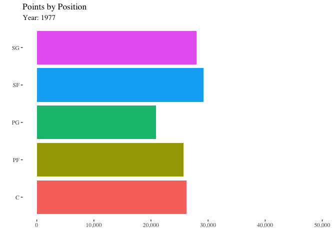
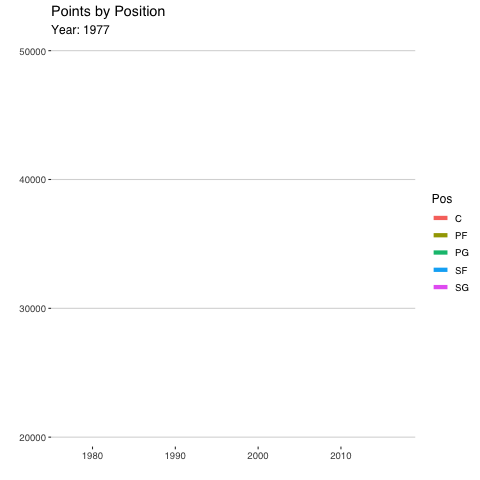

```{r setup, include=FALSE}
knitr::opts_chunk$set(echo = TRUE)
```

## R Markdown

This is an R Markdown document. Markdown is a simple formatting syntax for authoring HTML, PDF, and MS Word documents. For more details on using R Markdown see <http://rmarkdown.rstudio.com>.

When you click the **Knit** button a document will be generated that includes both content as well as the output of any embedded R code chunks within the document. You can embed an R code chunk like this:


Note that the `echo = FALSE` parameter was added to the code chunk to prevent printing of the R code that generated the plot.

```{r}
library(tidyverse)
library(transformr)
library(ggplot2)
library(plotly)
library(ggthemes)
library(gt)
library(knitr)
library(patchwork)
library(RColorBrewer)
library(gganimate)
library(lubridate)
library(readr)
library(scales)
```

```{r}


Seasons_Stats <- read_csv("Seasons_Stats.csv", 
    col_types = cols(GS = col_double(), MP = col_double(), 
        `3P` = col_double(), `3PA` = col_double(), 
        `3P%` = col_double()))
View(Seasons_Stats)

NBA_data <- Seasons_Stats %>% 
  filter(Year >= 1977) %>% 
  select(-'X1')

NBA_data[is.na(NBA_data)] <- 0

NBA_data

Players <- read_csv("Players.csv")
View(Players)
```

```{r}
nba_data2 <- NBA_data %>% 
  filter(Tm != "TOT") %>% 
  rename(twoPoint = '2P',
         twoPointP = '2P%',
         threePoint = '3P',
         threePointP = '3P%',
         freethrowP = 'FT%',
         FGP = 'FG%',
         USGP = 'USG%',
         threePointAttemps = '3PA',
         twoPointAttemps = '2PA',
         eFG = 'eFG%') %>% 
  select(Year, Player, Pos, Tm, G, MP, PER, FG, FGA, FGP, threePoint,
         threePointP, threePointAttemps, twoPoint, twoPointAttemps,
         twoPointP, eFG, FT, FTA, freethrowP, ORB, DRB, AST, BLK,
         PF, PTS, Age) %>% 
  group_by(Tm, Year) %>% 
  #Statistics by team by year
  mutate(Tm3PointAttempts = sum(threePointAttemps),
         TmPoints = sum(PTS),
         TmPPG = (TmPoints/82),
         TmPER = mean(PER),
         TmFGP = mean(FGP),
         TmFGA = sum(FGA)) %>% 
  ungroup() %>% 
  #Statistics by year for the entire NBA
  group_by(Year) %>% 
  mutate(YearPoints = sum(PTS),
         YearPPG = (YearPoints/82/43),
         Year3PA = sum(threePointAttemps),
         YearAvgMinutesPlayed = mean(MP),
         YearAvgPER = mean(PER),
         top3PP = max(threePointP),
         AvgAge = mean(Age)) %>% 
  ungroup() %>% 
  #Additional Statistics by Players
  group_by(Year, Player) %>% 
  mutate(PlayerPPG = PTS/G) %>% 
  ungroup() %>% 
  #I will filter the data to the teams still present in the nba
  filter(Tm %in% c("ATL", "BOS", "CLE", "DAL",
                   "DEN", "DET", "GSW", "BRK",
                   "HOU", "IND", "LAC",
                   "LAL", "MEM", "MIA", 
                   "MIL", "MIN", "NOP",
                   "NYK", "ORL", "PHI",
                   "PHO", "POR", "SAC",
                   "SAS", "TOR", "UTA"))

#Players <- Players %>% 
  #select(-'nothing')

nba_join_data <- nba_data2 %>%
  inner_join(Players,
             by = "Player")
 
nba_join_data
 
```

```{r}
nba_join_data %>% 
  filter(Tm %in% c("BOS", "MIL", "LAL", "NYK", "HOU"),
         Year != 1999,
         Year != 2012) %>% 
  ggplot(aes(x = Year, y = TmPPG, color = Tm)) +
  geom_line() + 
  theme_minimal() +
  theme(legend.position = "right") + 
  scale_color_manual(values = c("BOS" = "#009900",
                     "MIL" = "#006600",
                     "LAL" = "#9933FF",
                     "NYK" = "#FF6600",
                     "HOU" = "#FF0000")) + 
  labs(title = "NBA Team Points Per Game (1977 - 2017)",
       x = "",
       y = "",
       color = "Team") -> teamPPG_graph

#teamPPG_graph
 
nba_join_data %>% 
   filter(Year == "1986") %>% 
   ggplot(aes(y = TmPoints, x = TmFGA)) + 
   geom_point(aes(color = Tm, 
                  size = TmFGP),
              alpha = .6) + 
   theme(legend.position = "none",
         panel.grid.major.y = element_line(color = "black"),
         panel.grid.major.x = element_blank(),
         panel.background = element_rect(
                                         fill = "white")
                                                          ) + 
   labs(title = "Total Points (y) and FGA (x) of Teams in 1986",
        x = "",
        y = "",
        caption = element_text("*size determined by the team's average player efficiency"),
        color = "Team") -> TeamPPG_graph1986
 
 #TeamPPG_graph1986
 
 nba_join_data %>% 
   filter(Year == "2017") %>% 
   ggplot(aes(y = TmPoints, x = TmFGA)) + 
   geom_point(aes(color = Tm, 
                  size = TmFGP),
              alpha = .6) + 
   theme(legend.position = "none",
         panel.grid.major.y = element_line(color = "black"),
         panel.grid.major.x = element_blank(),
         panel.background = element_rect(
                                         fill = "white")
                                                          ) + 
   labs(title = "Total Points (y) and FGA (x) of Teams in 2017",
        x = "",
        y = "",
        color = "Team") -> TeamPPG_graph2017
  
 #TeamPPG_graph2017
 
(TeamPPG_graph1986 / TeamPPG_graph2017) / teamPPG_graph   -> three_graphs_team_ppg
 
 three_graphs_team_ppg 
  
```


A closer look at the discrete graph and some labels allow us to display 2017 teams scored similar amounts of points while taking 300-400 fewer shots. 

```{r}
nba_join_data %>% 
  filter(Year %in% c("1986", "2017")) %>% 
  ggplot(aes(x = TmFGA, y = TmPoints,
             color = Year)) + 
  geom_jitter(aes(size = TmFGP)) + 
  geom_rug(sides = 'b') + 
  scale_color_continuous(aes(option = "viridis")) + 
  theme(legend.position  = "none",
        plot.title = element_text(size = 14)) + 
  labs(title = "Total Points (y) and FGA (x) in 1986 & 2017",
       x = "",
       y = "") + 
  theme_pander() -> graph_mix_2017_1986

 ggplotly(graph_mix_2017_1986) -> mix_2017_1986plotly
 
 mix_2017_1986plotly

```

```{r, eval = FALSE}
#graph for what positions scored the most points
nba_join_data %>% 
  filter(MP >= 400) %>% 
  filter(Year != 2012,
         Year != 1999) %>% 
  group_by(Pos, Year) %>% 
  summarize(Points_by_Position = sum(PTS)) %>% 
  ungroup() %>% 
  arrange(desc(Points_by_Position)) %>% 
  ggplot() +
  geom_col(aes(x = Points_by_Position,
               y = Pos,
               fill = Pos)) +
  scale_x_continuous(labels = comma) + 
  scale_fill_discrete() + 
  theme_tufte() + 
  theme(legend.position = "none") + 
  labs(title = "Points by Position",
       subtitle = "Year: {closest_state}",
       x = "",
       y = "") + 
  transition_states(states = Year) -> Position_gif

animate(Position_gif,
        duration = 10)

anim_save("Points_by_Position.gif")

```

```{r}
 
```


```{r, eval = FALSE}
nba_join_data %>% 
  filter(MP >= 400) %>% 
  filter(Year != 2012,
         Year != 1999) %>% 
  group_by(Pos, Year) %>% 
  summarize(Points_by_Position = sum(PTS)) %>% 
  ungroup() %>% 
  arrange(desc(Points_by_Position)) %>% 
  ggplot() +
  geom_line(aes(x = Year,
               y = Points_by_Position,
               color = Pos),
            size = 2) +
  theme_hc() + 
  theme(legend.position = "right") + 
  labs(title = "Points by Position",
       subtitle = "Year: {frame_along}",
       x = "",
       y = "") + 
  transition_reveal(Year) 

anim_save("Points_by_Position_line.gif")
```


```{r}

```

```{r}
#Graphs by Decade?
nba_join_data %>% 
  filter(Year %in% c(1980:1989)) %>% 
  group_by(Player) %>% 
  mutate(games_played = sum(G),
         decade_points = sum(PTS),
         decade_FGP = mean(FGP),
         decade_AST = sum(AST)) %>% 
  arrange(desc(decade_points)) %>% 
  distinct(Player, decade_points, decade_FGP, games_played, decade_AST, Pos) %>% 
  filter(Player %in% c(
    "Alex English*",
    "Adrian Dantley*",
    "Larry Bird*",
    "Kareem Abdul-Jabbar*",
    "Moses Malone*",
    "Dominique Wilkins*",
    "Mark Aguirre",
    "Mike Mitchell",
    "Robert Parish*",
    "Magic Johnson*"
  )) %>% 
  ggplot() +
  geom_point(aes(x = games_played,
                 y = decade_points, 
                 color = Player,
                 shape = Pos,
                 label = decade_FGP),
             size = 3) + 
  theme_dark() +
  labs(title = "Decade Top Scorers (y) with Games Played (x) from 1980-1989",
       x = "", 
       y = "",
       color = "",
       shape = "",
       caption = "Some players competed at more than one position over the decade") -> top_players1980s_graph
  
ggplotly(top_players1980s_graph) -> top_players1980plotly

top_players1980plotly
  

```


```{r}
nba_join_data %>% 
  filter(Year %in% c(1990:1999)) %>% 
  group_by(Player) %>% 
  mutate(games_played = sum(G),
         decade_points = sum(PTS),
         decade_FGP = mean(FGP),
         decade_AST = sum(AST)) %>% 
  arrange(desc(decade_points)) %>% 
  distinct(Player, decade_points, decade_FGP, games_played, decade_AST, Pos) %>% 
  filter(Player %in% c(
    "Karl Malone*",
    "Patrick Ewing*",
    "David Robinson*",
    "Hakeem Olajuwon*",
    "Reggie Miller*",
    "Mitch Richmond*",
    "Charles Barkley*",
    "Tim Hardaway",
    "Clyde Drexler*",
    "Jeff Hornacek"
  )) %>% 
    ggplot() +
  geom_point(aes(x = games_played,
                 y = decade_points, 
                 color = Player,
                 shape = Pos,
                 label = decade_FGP),
             size = 3) + 
  theme_dark() +
  labs(title = "Decade Top Scorers (y) with Games Played (x) from 1990-1999",
       x = "", 
       y = "",
       color = "",
       shape = "",
       caption = "Some players competed at more than one position over the decade") -> top_players1990s_graph

ggplotly(top_players1990s_graph) -> top_players1990plotly

top_players1990plotly

```


```{r}
nba_join_data %>% 
  filter(Year %in% c(2000:2009)) %>% 
  group_by(Player) %>% 
  mutate(games_played = sum(G),
         decade_points = sum(PTS),
         decade_FGP = mean(FGP),
         decade_AST = sum(AST)) %>% 
  arrange(desc(decade_points)) %>% 
  distinct(Player, decade_points, decade_FGP, games_played, decade_AST, Pos) %>% 
  filter(Player %in% c(
    "Kobe Bryant",
    "Allen Iverson*",
    "Dirk Nowitzki",
    "Paul Pierce",
    "Kevin Garnett",
    "Tim Duncan",
    "Tracy McGrady",
    "Shaquille O'Neal*",
    "Shawn Marion",
    "LeBron James"
  )) %>% 
      ggplot() +
  geom_point(aes(x = games_played,
                 y = decade_points, 
                 color = Player,
                 shape = Pos,
                 label = decade_FGP),
             size = 3) + 
  theme_dark() +
  labs(title = "Decade Top Scorers (y) with Games Played (x) from 2000-2009",
       x = "", 
       y = "",
       color = "",
       shape = "",
       caption = "Some players competed at more than one position over the decade") -> top_players2000s_graph

ggplotly(top_players2000s_graph) -> top_players2000plotly

top_players2000plotly
  
  
```


```{r}
nba_join_data %>% 
  filter(Year %in% c(2010:2017)) %>% 
  group_by(Player) %>% 
  mutate(games_played = sum(G),
         decade_points = sum(PTS),
         decade_FGP = mean(FGP),
         decade_AST = sum(AST)) %>% 
  arrange(desc(decade_points)) %>% 
  distinct(Player, decade_points, decade_FGP, games_played, decade_AST, Pos) %>% 
  filter(Player %in% c(
    "LeBron James",
    "Carmelo Anthony",
    "Stephen Curry",
    "LeMarcus Aldridge",
    "DeMar DeRozan",
    "Dirk Nowitzki",
    "Monta Ellis",
    "James Harden",
    "DeMarcus Cousins",
    "Dwayne Wade"
  )) %>% 
        ggplot() +
  geom_point(aes(x = games_played,
                 y = decade_points, 
                 color = Player,
                 shape = Pos,
                 label = decade_FGP),
             size = 3) + 
  theme_dark() +
  labs(title = "Decade Top Scorers (y) with Games Played (x) from 2010-2017",
       x = "", 
       y = "",
       color = "",
       shape = "",
       caption = "Some players competed at more than one position over the decade") -> top_players2010s_graph

ggplotly(top_players2010s_graph) -> top_players2010plotly

top_players2010plotly
```

```{r}
nba_data2 %>% 
  filter(Year %in% c(1980:1989)) %>% 
  group_by(Player) %>% 
  mutate(decade_points = sum(PTS)) %>% 
  filter(decade_points > 5000) %>% 
  ggplot() + 
  geom_bar(aes(x = Pos, fill = Pos), alpha = .6) + 
  theme(legend.position = "none") +
  theme(panel.background = element_rect(fill = "white"),
        panel.grid.major.y = element_line(color = "black",
                                          linetype = "dotted" )) +
  labs(title = "Number of 5000 Point Scorers",
       x = "1980-1989",
       y = "") +
  scale_fill_manual(values = c("C" = "#000066",
                                "PF" = "#000099",
                                "SF" = "#0000CC",
                                "SG" = "#0000FF",
                                "PG" = "#3366CC")) -> graph1

nba_data2 %>% 
  filter(Year %in% c(1990:1999)) %>% 
  group_by(Player) %>% 
  mutate(decade_points = sum(PTS)) %>% 
  filter(decade_points > 5000) %>% 
  ggplot() + 
  geom_bar(aes(x = Pos, fill = Pos), alpha = .6) + 
  theme(legend.position = "none") +
  theme(panel.background = element_rect(fill = "white"),
        panel.grid.major.y = element_line(color = "black",
                                          linetype = "dotted" )) +
  labs(title = "",
       x = "1990-1999",
       y = "") +
  scale_fill_manual(values = c("C" = "#000066",
                                "PF" = "#000099",
                                "SF" = "#0000CC",
                                "SG" = "#0000FF",
                                "PG" = "#3366CC")) -> graph2

nba_data2 %>% 
  filter(Year %in% c(2000:2009)) %>% 
  group_by(Player) %>% 
  mutate(decade_points = sum(PTS)) %>% 
  filter(decade_points > 5000) %>% 
  ggplot() + 
  geom_bar(aes(x = Pos, fill = Pos), alpha = .6) + 
  theme(legend.position = "none") +
  theme(panel.background = element_rect(fill = "white"),
        panel.grid.major.y = element_line(color = "black",
                                          linetype = "dotted" )) +
  labs(title = "",
       x = "2000-2009",
       y = "") +
  scale_fill_manual(values = c("C" = "#000066",
                                "PF" = "#000099",
                                "SF" = "#0000CC",
                                "SG" = "#0000FF",
                                "PG" = "#3366CC")) -> graph3

nba_data2 %>% 
  filter(Year %in% c(2010:2017)) %>% 
  group_by(Player) %>% 
  mutate(decade_points = sum(PTS)) %>% 
  filter(decade_points > 4000) %>% 
  ggplot() + 
  geom_bar(aes(x = Pos, fill = Pos), alpha = .6) + 
  theme(legend.position = "none") +
  theme(panel.background = element_rect(fill = "white"),
        panel.grid.major.y = element_line(color = "black",
                                          linetype = "dotted" )) +
  labs(title = "",
       x = "2010-2017",
       y = "") +
  scale_fill_manual(values = c("C" = "#000066",
                                "PF" = "#000099",
                                "SF" = "#0000CC",
                                "SG" = "#0000FF",
                                "PG" = "#3366CC")) -> graph4

(graph1 | graph2) / (graph3 | graph4)  -> Point_scorers_by_decade_graph

Point_scorers_by_decade_graph

```


```{r}
nba_data2 %>% 
  filter(Year %in% c(1980:1989)) %>% 
  filter(Tm %in% c("BOS",
                   "MIL",
                   "LAL",
                   "LAC",
                   "ATL",
                   "DEN",
                   "ORL")) %>% 
  ggplot(aes(x = Year)) + 
  geom_line(aes(y = Tm3PointAttempts/9, color = Tm),
            size = 1) +
  scale_x_continuous(n.breaks = 9) +
  scale_y_continuous(name = "",
                     n.breaks = 6) + 
  theme_wsj() + 
    theme(legend.position = "bottom",
          legend.title = element_blank()) + 
  labs(title = "Team 3 Point FGA from 1980-1989") + 
  theme(plot.title = element_text(size = 15),
        axis.title.y.left = element_text(size = 9)) -> threePA_graph1980s

threePA_graph1980s

```

```{r}
nba_data2 %>% 
  filter(Year %in% c(1990:1999)) %>% 
  filter(Tm %in% c("BOS",
                   "MIL",
                   "LAL",
                   "LAC",
                   "ATL",
                   "DEN",
                   "ORL")) %>% 
  ggplot(aes(x = Year)) + 
  geom_line(aes(y = Tm3PointAttempts/9, color = Tm),
            size = 1) +
  scale_x_continuous(n.breaks = 9) +
  scale_y_continuous(name = "",
                     n.breaks = 6) + 
  theme_wsj() + 
    theme(legend.position = "bottom",
          legend.title = element_blank()) + 
  labs(title = "Team 3 Point FGA from 1990-1999") + 
  theme(plot.title = element_text(size = 15),
        axis.title.y.left = element_text(size = 9)) -> threePA_graph1990s

threePA_graph1990s
```

```{r}
nba_data2 %>% 
  filter(Year %in% c(2000:2009)) %>% 
  filter(Tm %in% c("BOS",
                   "MIL",
                   "LAL",
                   "LAC",
                   "ATL",
                   "DEN",
                   "ORL")) %>% 
  ggplot(aes(x = Year)) + 
  geom_line(aes(y = Tm3PointAttempts/9, color = Tm),
            size = 1) +
  scale_x_continuous(n.breaks = 9) +
  scale_y_continuous(name = "",
                     n.breaks = 6) + 
  theme_wsj() + 
    theme(legend.position = "bottom",
          legend.title = element_blank()) + 
  labs(title = "Team 3 Point FGA from 2000-2009") + 
  theme(plot.title = element_text(size = 15),
        axis.title.y.left = element_text(size = 9)) -> threePA_graph2000s

threePA_graph2000s
```

```{r}
nba_data2 %>% 
  filter(Year %in% c(2010:2017)) %>% 
  filter(Tm %in% c("BOS",
                   "MIL",
                   "LAL",
                   "LAC",
                   "ATL",
                   "DEN",
                   "ORL")) %>% 
  ggplot(aes(x = Year)) + 
  geom_line(aes(y = Tm3PointAttempts/9, color = Tm),
            size = 1) +
  scale_x_continuous(n.breaks = 9) +
  scale_y_continuous(name = "",
                     n.breaks = 6) + 
  theme_wsj() + 
    theme(legend.position = "bottom",
          legend.title = element_blank()) + 
  labs(title = "Team 3 Point FGA from 2010-2017") + 
  theme(plot.title = element_text(size = 15),
        axis.title.y.left = element_text(size = 9),
        axis.title.y.right = element_text(size = 9)) -> threePA_graph2010s

threePA_graph2010s
```

```{r}
nba_data2 %>% 
  filter(Year %in% c(1977:2017)) %>% 
  filter(Tm %in% c("BOS",
                   "MIL",
                   "LAL",
                   "LAC",
                   "ATL",
                   "DEN",
                   "ORL")) %>% 
  ggplot(aes(x = Year)) + 
  geom_line(aes(y = Tm3PointAttempts/9, color = Tm),
            size = 1) +
  scale_x_continuous(n.breaks = 9) +
  scale_y_continuous(name = "",
                     n.breaks = 6) + 
  theme_wsj() + 
    theme(legend.position = "bottom",
          legend.title = element_blank()) + 
  labs(title = "Team 3 Point FGA All Time") + 
  theme(plot.title = element_text(size = 15),
        axis.title.y.left = element_text(size = 9)) -> threePA_graphAllTime

threePA_graphAllTime
```

```{r, eval = FALSE}
#composition of the league
nba_data2 %>% 
  group_by(Pos, Year) %>% 
  count() %>% 
  ungroup() %>% 
  group_by(Year) %>% 
  mutate(total_players = sum(n),
         prop = n/total_players,
         hello = sum(prop)) %>% 
  ggplot(aes(x = "",y = prop, fill = Pos, group = Year)) + 
  geom_bar(stat = "identity", width = 1) + 
  coord_polar("y", start = 0) + 
  geom_text(aes(label = paste0(round(prop*100),"%")), position = position_stack(vjust = 0.5)) + 
  scale_fill_manual(values = c("C" = "orange",
                               "PF" = "lightblue",
                               "PG" = "lightgreen",
                               "SF" = "yellow",
                               "SG" = "#FF3333")) + 
  labs(x = "",
       y = "",
       fill = "",
       title = "NBA Composition by Position",
       subtitle = "Year: {closest_state}") + 
  theme_classic() + 
  theme(axis.line = element_blank(),
        axis.text = element_blank(),
        axis.ticks = element_blank(),
        plot.title = element_text(size = 14, hjust = 0.5),
        plot.subtitle = element_text(hjust = 0.5, face = "bold")) + 
  transition_states(Year)

anim_save("pie_chart_nba_composition.gif")

```


```{r}
knitr::include_graphics("pie_chart_nba_composition.gif")
```


```{r}
nba_data2 %>% 
  filter(Year >= 1984) %>% 
  group_by(Year, Pos) %>% 
  summarize(position3PA = sum(threePointAttemps)) %>% 
  group_by(Year) %>% 
  mutate(year3PA = sum(position3PA),
         hi = position3PA/year3PA,
         test = sum(hi)) %>% 
  ggplot(aes(x = "",y = hi, fill = Pos, group = Year)) + 
  geom_bar(stat = "identity", width = 1) + 
  coord_polar("y", start = 0) + 
  geom_text(aes(label = paste0(round(hi*100),"%")), position = position_stack(vjust = 0.5)) + 
  scale_fill_manual(values = c("C" = "orange",
                               "PF" = "lightblue",
                               "PG" = "lightgreen",
                               "SF" = "yellow",
                               "SG" = "#FF3333")) + 
  labs(x = "",
       y = "",
       fill = "",
       title = "NBA 3PA by Position",
       subtitle = "Year: {closest_state}") + 
  theme_classic() + 
  theme(axis.line = element_blank(),
        axis.text = element_blank(),
        axis.ticks = element_blank(),
        plot.title = element_text(size = 14, hjust = 0.5),
        plot.subtitle = element_text(hjust = 0.5, face = "bold")) + 
  transition_states(Year)

anim_save("pie_chart_nba3PA_by_position.gif")
  
```


```{r}
knitr::include_graphics("pie_chart_nba3PA_by_position.gif")
```

```{r}
nba_data2 %>% 
  filter(Tm %in% c("BOS",
                     "ATL",
                     "BRK",
                     "CLE",
                     "DAL",
                     "DEN",
                     "DET",
                     "GSW")) %>% 
  ggplot(aes(x = Year)) +
  geom_line(aes(y = TmPER, color = Tm), size = .5) + 
  scale_color_colorblind() + 
  scale_x_continuous(n.breaks = 10) + 
  theme_economist() + 
  theme(legend.position = "right",
        axis.title.x = element_blank()) + 
  labs(title = "Average Team PER by Year",
       x = "",
       y = "",
       color = "Team") -> teamPER_by_year_graph

teamPER_by_year_graph
```

```{r}
#correlation between 3PA and overall points
nba_data2 %>% 
  filter(Year %in% c(1984)) %>% 
  ggplot(aes(x = TmPoints)) +
  geom_point(aes(y = Tm3PointAttempts, color = Tm)) + 
  theme_minimal() +
  theme(legend.position = "none") +
  labs(title = "1984",
       x = "",
       y = "") + 
  theme(plot.title = element_text(hjust = 0.5,face = "bold"))  -> hello1

nba_data2 %>% 
  filter(Year %in% c(2017)) %>% 
  ggplot(aes(x = TmPoints)) + 
  geom_point(aes(y = Tm3PointAttempts, color = Tm))+
  theme(legend.position = "none") + 
  labs(title = "Individual Team's 3PA (y)  and Total Points (x)",
       y = "",
       x = "2017") + 
  theme_minimal() +
  theme(plot.title = element_text(face = "bold", hjust = 0.5),
        axis.title.x = element_text(face = "bold"),
        legend.position = "none")  -> hello2

correlation_graph <- hello1 / hello2
  
correlation_graph

```


